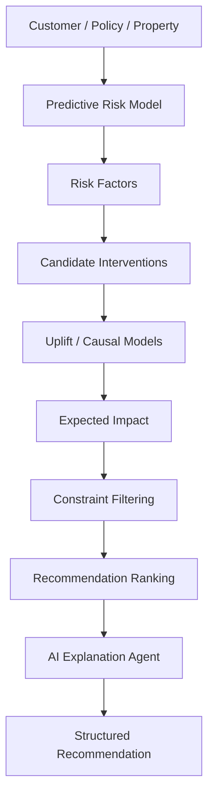
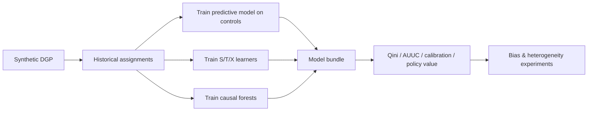

# Architecture

## Online path



## Offline path



## Prediction vs uplift

```mermaid
flowchart TB
  X[Features X] --> P[P Y=1 | X]
  X --> T0[P Y=1 | X, T=0]
  X --> T1[P Y=1 | X, T=1]
  T0 --> CATE[CATE = T0 - T1]
  T1 --> CATE
  P --> Risk[Risk ranking]
  CATE --> Benefit[Who benefits]
  Risk -.->|not sufficient| Benefit
```

## Ranking objective

For each eligible intervention:

```
utility = w_b * scaled_CATE
        + w_c * confidence
        + w_f * feasibility
        - w_cost * normalized_cost
        - w_burden * customer_burden
```

Hard filters remove recently contacted customers, annual caps, and clearly unsuitable specialist/fraud actions.

## Agent contract

1. Inspect risk factors via `get_risk_factors`  
2. Retrieve evidence via `get_evidence_summary`  
3. Examine candidates via `get_candidate_interventions`  
4. Call uplift / causal tools  
5. Compare interventions  
6. Explain trade-offs with grounded bullets  
7. Emit a structured `Recommendation`  

The LLM (optional) may rewrite narrative text but **must not invent** probabilities, CATEs, costs, or confidence scores.

## Counterfactual consistency

The simulator reports uplift-consistent quantities:

```
P0 = P(loss | X, T=0)
P1 = P(loss | X, T=1)
CATE = P0 − P1
```

Predictive `P(loss | X)` is returned separately as `p_loss_predictive` so the UI never mixes prediction and treatment-effect arithmetic.

## UI architecture

Static production UI (`ui/static/{index.html,app.css,app.js}`) served by FastAPI:

- design tokens + component states (default/hover/active/disabled/loading/error)
- pipeline stage strip, risk gauge, CATE charts, agent tool timeline
- Model Compare + Research Lab + Architecture views
- Playwright browser E2E screenshots in `docs/qa/screenshots/`

## Synthetic confounding design

Historical treatment assignment depends on:

- baseline risk  
- contactability  
- engagement  
- intervention cost  

Therefore treated and control groups differ systematically. Naive ATE ≠ true CATE. A 20% RCT slice provides an unconfounded reference.
